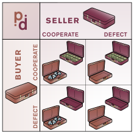

# Iterative Prisoner's Dilemma

### Description

The Prisoner’s Dilemma (PD) is a very well known Game Theory case of study, which is widely used to (attempt to) model social/economical interaction. It's a "dilemma" as, if exploited to explain the emergence of altruism in human or in general animal society, it fails badly at a first glance.

In the literature it can be found exposed in different interpretations, and we are going to follow the following one:

*Two people meet and exchange closed bags, with the understanding that one of them contains money, and the other contains a purchase. Either player can choose to honor the deal by putting into his or her bag what he or she agreed, or he or she can defect by handing over an empty bag.*

In this project we will use the following basic linear algebra framework in order to obtain the players' rewards. Given the payoff matrix , that quantifies the revenue that each player gets depending on whether he cooperates or not, the  player reward can be computed as:

where:

 

It is obvious that for both players the winning strategy is to not cooperate. In fact defecting is the strincly dominant strategy and this leads to the result that the expected game outcome will be that both players decide to defect, and this outcome will be a Nash Equilibrium.

But we can notice that the reward obtained by each player when they both decide to collaborate would be higher, in fact this outcome would be Pareto Efficient, namely there would be no way in the whole game that a player can improve his reward without the other player reward get worse.

Things changes when the interaction between the two individuals is iterated, in that case a more altruist attitude (strategy) is expected to emerge. The goal of this project is to test this hypothesis.

In an Iterative Prisoner's Dilemma (IPD), two players play prisoner's dilemma more than once in succession and they remember previous actions of their opponent and change their strategy accordingly. The winning strategy is the one which yields to a larger reward at the end of the IPD.

### Assignments

* Implement a simple IPD between two players implementing two given strategies. Study the evolution along the tournament confronting different strategies; study the overall outcome in the different configurations. 
* Implement a multiple players IPD (MPIPD) where several strategies play against each other in a roud-robin scheme
* Iterate what done in the previous task (repeated MPIPD, rMPIPD)  by increasing the population implementing a given strategy depending on the results that strategy achieved in the previous iteration
* (*difficult*) Implement a rMPIPD where strategies are allowed to mutate. The goal is to simulate the effect of genetic mutations and the effect of natura selection. A parameter (gene) should encode the attidue of an individual to cooperate, such gene can mutate randomly and the corresponding phenotype should compete in the MPIPD such that the best-fitted is determined.  
